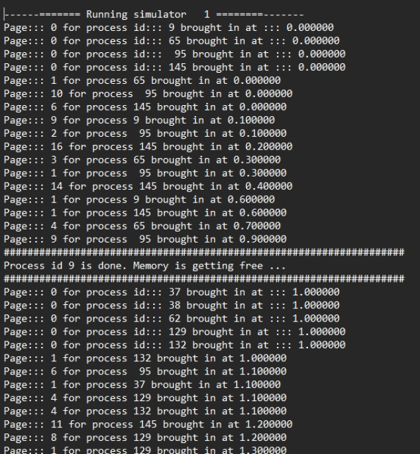
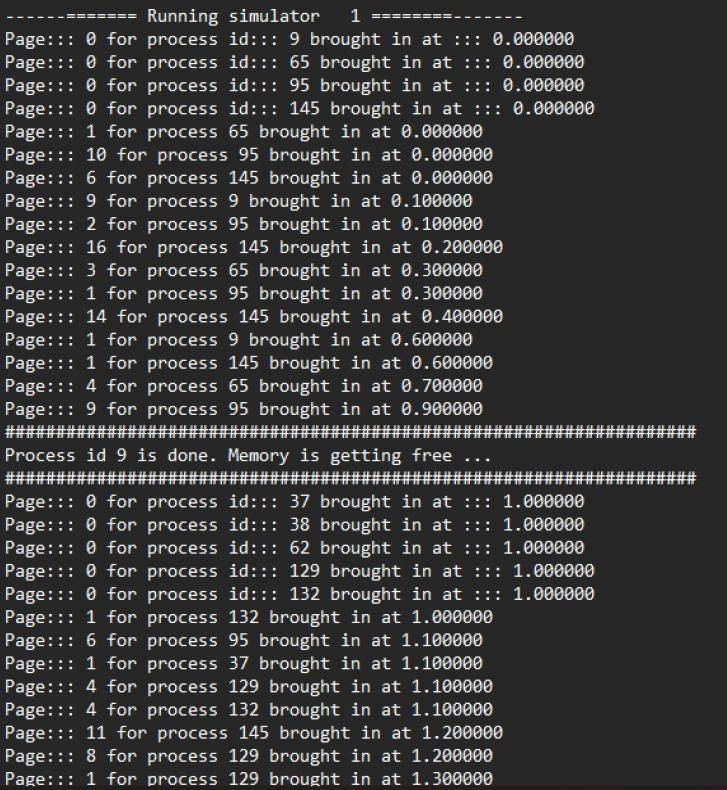
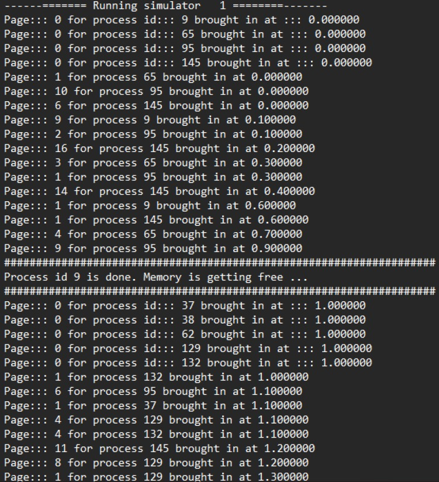
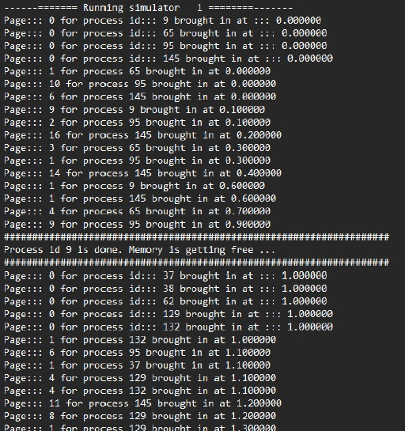
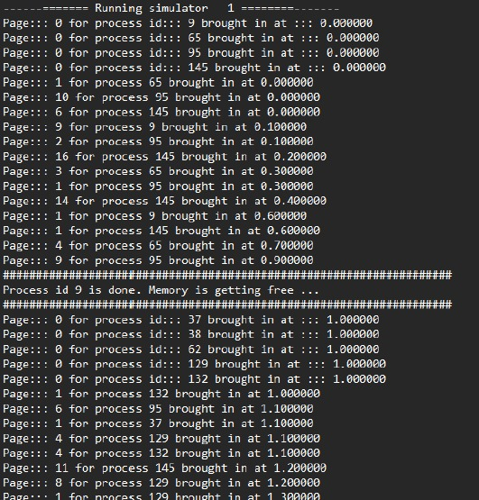

# Simulation_OS_Assignment03

### FIFO Algorithm in C (FIFO_Algorithm.c)

The FIFO (First-In, First-Out) algorithm is a page replacement algorithm that maintains the order of pages based on their arrival time into memory. When a page needs to be replaced, the oldest page, which entered the memory first, is the one chosen for replacement.

Program Overview:
This program manages pages using a FIFO queue structure to store all pages currently residing in memory.
It employs a while loop to traverse the list of pages. When reaching the end of the list, the algorithm replaces the oldest page with the new page to accommodate the latest memory request.

  

### LRU Algorithm in C (LRU_Algorithm.c)

The LRU (Least Recently Used) algorithm selects the page for replacement based on the page that has not been accessed or used for the longest duration. It assumes that the page that has been least recently used is the best candidate for replacement.

Program Overview:
This program maintains a record of all previously used pages, monitoring their recent usage.
When a page replacement is necessary, the algorithm identifies and replaces the page that has been least recently used by the new page.
The variable FITLRU->LONE tracks the recent usage of each specific page within this program.

  

### MFU Algorithm in C (MFU_Algorithm.c)

The MFU (Most Frequently Used) algorithm selects the page for replacement based on the page that has been accessed or used the most number of times in the past. It assumes that frequently used pages may have lower future necessity.

Program Overview:
This program employs the FITM->CNTER variable to track the number of times each page is accessed or used.
Using a while loop, the algorithm identifies the page that has been most frequently used.
Upon replacement necessity, the algorithm replaces this frequently used page with the newly arrived page.

  

### LFU Algorithm in C (LFU_Algorithm.c)

The LFU (Least Frequently Used) algorithm selects the page for replacement based on the page that has been accessed or used the least number of times in the past. It assumes that pages with fewer past accesses might be less crucial or relevant.

Program Overview:
This program utilizes the FITLFU->CNTER variable to track the number of times each page is accessed or used.
By employing a while loop, the algorithm identifies the page that has been least frequently used.
When a replacement is necessary, the algorithm replaces this less frequently used page with the newly arrived page.

  

### Random Pick Algorithm in C (Random_Algorithm.c)

The Random Pick algorithm selects a page for replacement randomly when a page needs to be replaced. It does so by choosing a page randomly from the set of pages in memory and replacing it with the new page.

Program Overview:
This program utilizes the `rand()` function, which generates random numbers, to facilitate the replacement of pages.
By using `rand()`, the program generates a random number and checks if the generated number falls within a certain range.
If the random number satisfies the specified condition, the algorithm selects and replaces the corresponding page with the new page.

  

### PAGE.h:
Here we declare all the variables and functions that we will be using.

### PAGE.c:
Here we define the already declared functions of the page.

### Simulation.c: Evaluating Page Replacement Algorithms

In the main program Simulation.c, various functions implementing page replacement algorithms are simulated and called. Hit and miss ratios are calculated for each simulation using information from log files and averages displayed in the console.

Based on the analysis of log files and average data in the console, the performance comparison among the page replacement algorithms is as follows:

1. **Random Pick Algorithm:** This algorithm demonstrated the most effective performance according to the observed log files and console averages. Its randomized approach appeared advantageous in achieving better hit rates by occasionally selecting pages randomly, possibly avoiding repetitive patterns.

2. **LRU (Least Recently Used) Algorithm:** LRU ranked as the second-best algorithm among those evaluated. Known for its reliability in various scenarios, LRU showed commendable performance compared to the others tested.

3. **MFU (Most Frequently Used) Algorithm:** In contrast, the MFU algorithm performed the least favorably in this evaluation. Despite its intent to prioritize frequently used pages, it seemed less adaptive to the specific workload characteristics observed in the simulations.

4. **Considerations:** The assessment highlights that the effectiveness of a page replacement algorithm can be contingent upon the workload's unique attributes. Although LRU is generally considered a dependable algorithm, its superiority might not be consistent across all scenarios. Some systems opt for hybrid approaches or dynamic algorithm switching based on evolving system states and workload dynamics.

In conclusion, the choice of the "best" page replacement algorithm depends heavily on workload-specific features. While Random Pick Algorithm showcased better performance in this instance, selecting the most suitable algorithm often involves considering various factors, and no single algorithm guarantees superior performance universally. Adaptability and experimentation are crucial in determining the optimal algorithm for specific system contexts.

  
## Execution:
$gcc SIMULATION.c PAGE.c FIFO.c LFU.c MFU.c LRU.c R.c -o SIMULATION  
$./SIMULATION [FCFS/LRU/Random/MFU/LFU]
